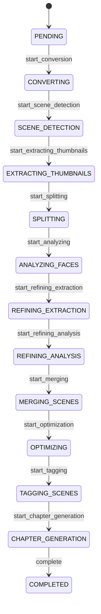

# Video Processing Pipeline

The processing of a video is managed by a **Symfony Workflow (State Machine)** to ensure consistent status transitions.

## Pipeline-Struktur

Die Verarbeitungskette besteht aus den folgenden Schritten, die durch Message-Handler gesteuert werden:

| Step # | Logger Ident | Message Class | Video Status (Current Step) | Transition to Next? | By transition | Next Message Class |
|--------|--------------|---------------|-----------------------------|---------------------|---------------|--------------------|
| 1 | CONVERSION TO MP4 | ConvertStepMessage | converting | Ja | START_SCENE_DETECTION | SceneDetectionStepMessage |
| 2 | SCENE DETECTION | SceneDetectionStepMessage | scene_detection | Ja | START_EXTRACTING_THUMBNAILS | ExtractFirstSceneThumbnailStepMessage |
| 3 | EXTRACT FIRST SCENE THUMBNAIL | ExtractFirstSceneThumbnailStepMessage | extracting_thumbnails | Nein | | ExtractSceneThumbnailStepMessage |
| 4 | EXTRACT SCENE THUMBNAIL | ExtractSceneThumbnailStepMessage | extracting_thumbnails | Nein | | ExtractLastSceneThumbnailStepMessage |
| 5 | EXTRACT LAST SCENE THUMBNAIL | ExtractLastSceneThumbnailStepMessage | extracting_thumbnails | Ja | START_SPLITTING | SplitVideoInFramesStepMessage |
| 6 | SPLITTING ENTIRE VIDEO INTO FRAMES | SplitVideoInFramesStepMessage | video_splitting | Ja | START_ANALYZING | AnalyzeFirstVideoFrameStepMessage |
| 7 | ANALYZE FIRST VIDEO FRAME | AnalyzeFirstVideoFrameStepMessage | analyzing_faces_initial | Nein | | AnalyzeVideoFrameStepMessage |
| 8 | ANALYZE VIDEO FRAME | AnalyzeVideoFrameStepMessage | analyzing_faces_initial | Nein | | AnalyzeLastVideoFrameStepMessage |
| 9 | ANALYZE LAST VIDEO FRAME | AnalyzeLastVideoFrameStepMessage | analyzing_faces_initial | Ja | START_REFINING_EXTRACTION | InitRefinementForEmptyScenesStepMessage |
| 10 | INIT REFINEMENT FOR EMPTY SCENES | InitRefinementForEmptyScenesStepMessage | refining_extraction | Ja | START_REFINING_SPLITTING | SplitFirstSceneInFramesStepMessage |
| 11 | SPLIT FIRST SCENE IN FRAMES | SplitFirstSceneInFramesStepMessage | refining_splitting | Nein | | SplitSceneInFramesStepMessage |
| 12 | SPLIT SCENE IN FRAMES | SplitSceneInFramesStepMessage | refining_splitting | Nein | | SplitLastSceneInFramesStepMessage |
| 13 | SPLIT LAST SCENE IN FRAMES | SplitLastSceneInFramesStepMessage | refining_splitting | Ja | START_REFINING_ANALYSIS | AnalyzeFirstSceneFrameStepMessage |
| 14 | ANALYZE FIRST SCENE FRAME | AnalyzeFirstSceneFrameStepMessage | analyzing_faces_refinement | Nein | | AnalyzeSceneFrameStepMessage |
| 15 | ANALYZE SCENE FRAME | AnalyzeSceneFrameStepMessage | analyzing_faces_refinement | Nein | | AnalyzeLastSceneFrameStepMessage |
| 16 | ANALYZE LAST SCENE FRAME | AnalyzeLastSceneFrameStepMessage | analyzing_faces_refinement | Ja | START_MERGING | MergeScenesStepMessage |
| 17 | MERGE EMPTY SCENES TOGETHER | MergeScenesStepMessage | merging_scenes | Ja | START_TAGGING | TagFirstSceneStepMessage |
| 18 | TAG FIRST SCENE | TagFirstSceneStepMessage | tagging_scenes | Nein | | TagSceneStepMessage |
| 19 | TAG SCENE | TagSceneStepMessage | tagging_scenes | Nein | | TagLastSceneStepMessage |
| 20 | TAG LAST SCENE | TagLastSceneStepMessage | tagging_scenes | Ja | START_CHAPTER_GENERATION | GenerateChapterStepMessage |
| 21 | GENERATE CHAPTERS | GenerateChapterStepMessage | chapter_generation | Ja | START_EXPORT | UploadToJellyfinStepMessage |
| 22 | UPLOAD TO JELLYFIN | UploadToJellyfinStepMessage | exporting_jellyfin | Ja | COMPLETE | - |

## Workflow-Architektur

Der Workflow wird über eine **State Machine** (`video_processing`) gesteuert. Der aktuelle Status wird direkt auf der `Video`-Entität gespeichert.

### Zustände (Places)
- **PENDING**: Registriert, noch keine Verarbeitung.
- **CONVERTING**: Konvertierung in kompatibles Format.
- **SCENE_DETECTION**: Szenenerkennung.
- **EXTRACTING_THUMBNAILS**: Thumbnail-Extraktion.
- **SPLITTING**: Frame-Extraktion.
- **ANALYZING_FACES**: Gesichts- und Inhaltsanalyse.
- **REFINING_EXTRACTION**: Extraktion bei Refinement.
- **REFINING_ANALYSIS**: Analyse bei Refinement.
- **MERGING_SCENES**: Szenen zusammenführen.
- **OPTIMIZING**: Optimierung für Mediensysteme.
- **TAGGING_SCENES**: Tagging.
- **CHAPTER_GENERATION**: Kapitel-Erstellung.
- **COMPLETED**: Abschluss.
- **ERROR**: Fehler.

### Workflow Transitions
- `start_conversion`: PENDING -> CONVERTING
- `start_scene_detection`: ... -> SCENE_DETECTION
- `start_extracting_thumbnails`: SCENE_DETECTION -> EXTRACTING_THUMBNAILS
- `start_splitting`: EXTRACTING_THUMBNAILS -> SPLITTING
- `start_analyzing`: SPLITTING -> ANALYZING_FACES
- `start_refining_extraction`: ANALYZING_FACES -> REFINING_EXTRACTION
- `start_refining_analysis`: REFINING_EXTRACTION -> REFINING_ANALYSIS
- `start_merging`: REFINING_ANALYSIS -> MERGING_SCENES
- `start_optimization`: MERGING_SCENES -> OPTIMIZING
- `start_tagging`: OPTIMIZING -> TAGGING_SCENES
- `start_chapter_generation`: TAGGING_SCENES -> CHAPTER_GENERATION
- `complete`: CHAPTER_GENERATION -> COMPLETED

### Mermaid-Diagramm

