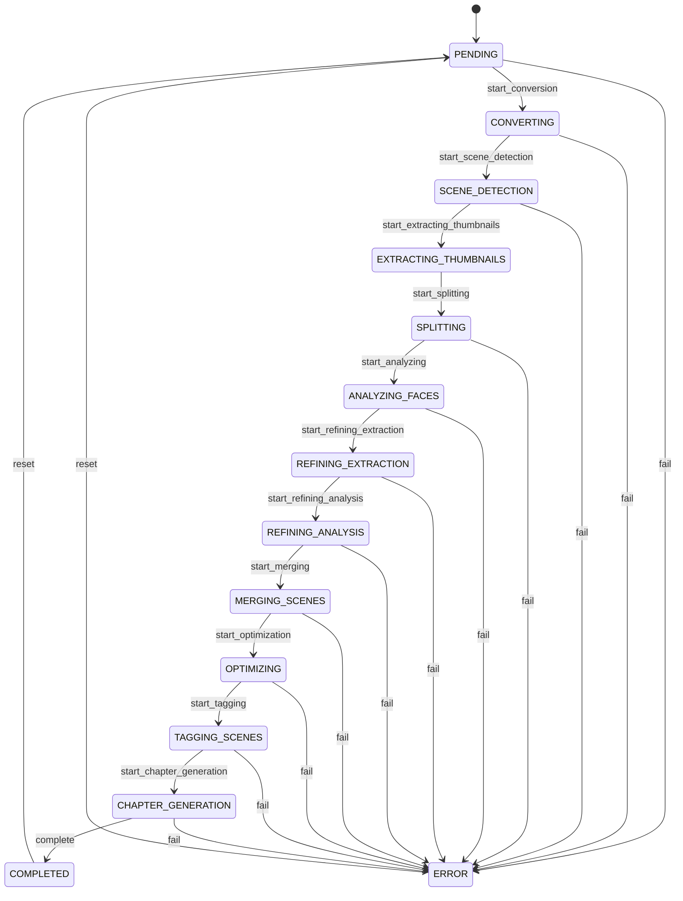

# Video-Workflow Dokumentation

Dieser Workflow verwaltet den Status eines Videos während des gesamten Verarbeitungsprozesses (von der ersten Ankündigung bis zur Fertigstellung oder Fehlern).

## Übersicht

Der Workflow ist als **State Machine** (`video_processing`) in Symfony implementiert. Der aktuelle Status wird direkt auf der `Video`-Entität in der Eigenschaft `status` gespeichert.

## Zustände (Places)

- **PENDING**: Das Video wurde registriert, aber noch keine Verarbeitung gestartet.
- **CONVERTING**: Video wird in ein kompatibles Format konvertiert.
- **SCENE_DETECTION**: Szenen im Video werden erkannt.
- **EXTRACTING_THUMBNAILS**: Vorschaubilder werden extrahiert.
- **SPLITTING**: Das Video wird in einzelne Szenen zerteilt.
- **ANALYZING_FACES**: Gesichter in den Szenen werden analysiert.
- **REFINING_EXTRACTION**: Extraktion der Szenen wird verfeinert.
- **REFINING_ANALYSIS**: Analyse der Szenen wird verfeinert.
- **MERGING_SCENES**: Szenen werden wieder zusammengeführt.
- **OPTIMIZING**: Das Video wird für Jellyfin optimiert.
- **TAGGING_SCENES**: Szenen werden mit Tags versehen.
- **CHAPTER_GENERATION**: Kapitel werden generiert.
- **COMPLETED**: Verarbeitung erfolgreich abgeschlossen.
- **ERROR**: Ein Fehler ist aufgetreten.

## Mermaid-Diagramm

## Technische Hinweise

- Der Workflow wird über den `WorkflowMachine`-Service (`src/Service/WorkflowMachine.php`) gesteuert.
- Jeder `apply()`-Aufruf löst ein `flush()` auf dem `EntityManager` aus, um den Status sofort in der Datenbank zu persistieren.
- Änderungen des Status sollten immer über diesen Service erfolgen, um Konsistenz sicherzustellen.
